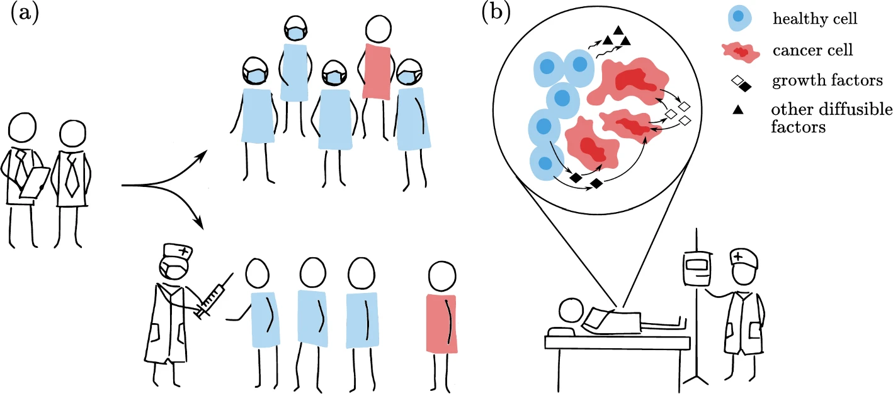
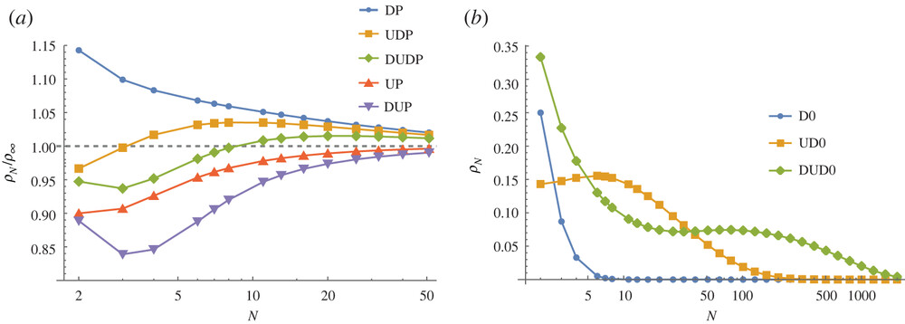

Here is a list of some of my recent publications.

## Published:
* <b>Public Goods Games in Disease Evolution and Spread</b> (2025)
   
  
  We review PGGs arising in the disease modelling of cancer evolution and the spread of infectious diseases. We propose that applications of evolutionary game theory to decision-making in cancer, such as interactions between a clinician and a tumour (b), can learn from the PGGs studied in epidemiology, where cooperative behaviours such as quarantine and vaccination compliance have been more thoroughly investigated (a).
  <!--Cooperation arises in nature at every scale, from within cells to entire ecosystems. In the framework of evolutionary game theory, public goods games (PGGs) are used to analyse scenarios where individuals can cooperate or defect, and can predict when and how these behaviours emerge. However, too few examples motivate the transferal of knowledge from one application of PGGs to another. Here, we focus on PGGs arising in disease modelling of cancer evolution and the spread of infectious diseases. We use these two systems as case studies for the development of the theory and applications of PGGs, which we succinctly review and compare. We also posit that applications of evolutionary game theory to decision-making in cancer, such as interactions between a clinician and a tumour, can learn from the PGGs studied in epidemiology, where cooperative behaviours such as quarantine and vaccination compliance have been more thoroughly investigated. Furthermore, instances of cellular-level cooperation observed in cancers point to a corresponding area of potential interest for modellers of other diseases, be they viral, bacterial or otherwise. We aim to demonstrate the breadth of applicability of PGGs in disease modelling while providing a starting point for those interested in quantifying cooperation arising in healthcare.-->
   
  
     
  Christo Morison, Małgorzata Fic, Thomas Marcou, Javad Mohamadichamgavi, Javier Redondo Antón, Golsa Sayyar, Alexander Stein, Frank Bastian, Hana Krakovská, Nandakishor Krishnan, <b>Diogo L. Pires</b>, Mohammadreza Satouri, Frederik J. Thomsen, Kausutua Tjikundi, Wajid Ali 
  Dynamic Games and Applications https://doi.org/10.1007/s13235-025-00619-5  
  (<a href="https://link.springer.com/article/10.1007/s13235-025-00619-5" target="_blank">link</a>) (<a href="https://link.springer.com/article/10.1007/s13235-025-00619-5#citeas" target="_blank">pdf</a>)  
  
  
* <b>The rules of multiplayer cooperation in networks of communities</b> (2024)
   
    
  We obtain the rules of multiplayer cooperation in networks of communities for social dilemmas caracterizing different types of social behaviour. Community organization is a solid mechanism for sustaining the evolution of cooperation under public goods dilemmas, particularly when populations are organized into a higher number of smaller communities. The success of cooperation is a result of the benefits shared amongst communal cooperators outperforming the benefits reaped by defectors in mixed communities. 
  
  
     
  <b>Diogo L. Pires</b>, Mark Broom 
  PLoS Computational Biology 20(8): e1012388 
  (<a href="https://journals.plos.org/ploscompbiol/article?id=10.1371/journal.pcbi.1012388" target="_blank">link</a>) (<a href="https://journals.plos.org/ploscompbiol/article?id=10.1371/journal.pcbi.1012388" target="_blank">pdf</a>)  
   
     
  <!--Community organization permeates both social and biological complex systems. To study its interplay with behavior emergence, we model mobile structured populations with multiplayer interactions. We derive general analytical methods for evolutionary dynamics under high home fidelity when populations self-organize into networks of asymptotically isolated communities. In this limit, community organization dominates over the network structure and emerging behavior is independent of network topology. We obtain the rules of multiplayer cooperation in networks of communities for different types of social dilemmas. The success of cooperation is a result of the benefits shared amongst communal cooperators outperforming the benefits reaped by defectors in mixed communities. Under weak selection, cooperation can evolve and be stable for any size (Q) and number (M) of communities if the reward-to-cost ratio (V/K) of public goods is higher than a critical value. Community organization is a solid mechanism for sustaining the evolution of cooperation under public goods dilemmas, particularly when populations are organized into a higher number of smaller communities. Contrary to public goods dilemmas relating to production, the multiplayer Hawk-Dove (HD) dilemma is a commons dilemma focusing on the fair consumption of preexisting resources. This game holds mixed results but tends to favour cooperation under larger communities, highlighting that the two types of social dilemmas might lead to solid differences in the behaviour adopted under community structure.-->
  
  
* <b>Network topology and movement cost, not updating mechanism, determine the evolution of cooperation in mobile structured populations</b> (2023)
   
    
  We investigate the evolution of multiplayer cooperation in mobile structured populations, where individuals move strategically on networks and interact with those they meet in groups of variable size. Group-dependent movement erases the locality of interactions and leads to assortative behaviour that is much more powerful in promoting cooperation than fixed population structure. Cooperation robustly co-evolves with movement on complete and circle networks for six different evolutionary dynamics (in figure).
  
  
     
  <b>Diogo L. Pires</b>, Igor V. Erovenko, Mark Broom 
  PLoS ONE 18(8). e0289366 
  (<a href="https://journals.plos.org/plosone/article?id=10.1371/journal.pone.0289366" target="_blank">link</a>) (<a href="https://journals.plos.org/plosone/article?id=10.1371/journal.pone.0289366" target="_blank">pdf</a>)  
   
     
  <!--Evolutionary models are used to study the self-organisation of collective action, often incorporating population structure due to its ubiquitous presence and long-known impact on emerging phenomena. We investigate the evolution of multiplayer cooperation in mobile structured populations, where individuals move strategically on networks and interact with those they meet in groups of variable size. We find that the evolution of multiplayer cooperation primarily depends on the network topology and movement cost while using different stochastic update rules seldom influences evolutionary outcomes. Cooperation robustly co-evolves with movement on complete networks and structure has a partially detrimental effect on it. These findings contrast an established principle from evolutionary graph theory that cooperation can only emerge under some update rules and if the average degree is lower than the reward-to-cost ratio and the network far from complete. We find that group-dependent movement erases the locality of interactions, suppresses the impact of evolutionary structural viscosity on the fitness of individuals, and leads to assortative behaviour that is much more powerful than viscosity in promoting cooperation. We analyse the differences remaining between update rules through a comparison of evolutionary outcomes and fixation probabilities.-->
   
  
* <b>More can be better: An analysis of single-mutant fixation probability functions under 2×2 games</b> (2022)
   
  
  We study 2×2 games in well-mixed finite populations by analyzing the fixation probabilities of single mutants as functions of population size. We show that fixation functions showed increasing regions under 12 distinct anti-coordination, coordination and dominance games. Perhaps counter-intuitively, this establishes that single-mutant strategies often benefit from being in larger populations.
   
   
   
  <b>Diogo L. Pires</b>, Mark Broom 
  Proceedings of the Royal Society A: Mathematical, Physical and Engineering Sciences. 4782022057720220577 
  (<a href="https://royalsocietypublishing.org/doi/full/10.1098/rspa.2022.0577" target="_blank">link</a>) (<a href="https://royalsocietypublishing.org/eprint/VWSNTSCYIIAXFAFT2HJ3/full" target="_blank">pdf</a>)  
   
   
  <!--Evolutionary game theory has proved to be a powerful tool to probe the self-organization of collective behaviour by considering frequency-dependent fitness in evolutionary processes. It has shown that the stability of a strategy depends not only on the payoffs received after each encounter but also on the population’s size. Here, we study 2×2 games in well-mixed finite populations by analyzing the fixation probabilities of single mutants as functions of population size. We proved that nine of the 24 possible games always lead to monotonically decreasing functions, similarly to fixed fitness scenarios. However, fixation functions showed increasing regions under 12 distinct anti-coordination, coordination and dominance games. Perhaps counter-intuitively, this establishes that single-mutant strategies often benefit from being in larger populations. Fixation functions that increase from a global minimum to a positive asymptotic value are pervasive but may have been easily concealed by the weak selection limit. We obtained sufficient conditions to observe fixation increasing for small populations and three distinct ways this can occur. Finally, we describe fixation functions with the increasing regions bounded by two extremes under intermediate population sizes. We associate their occurrence with transitions from having one global extreme to other shapes.-->
   

## Preprints:

* <b>Self-organisation of common goods usage and an application to Internet services</b>
   
     
  <b>Diogo L. Pires</b>, Vincenzo Mancuso, Paolo Castagno, Marco Ajmone Marsan 
  arXiv:2504.07175  
  (<a href="https://arxiv.org/abs/2504.07175" target="_blank">link</a>) (<a href="https://arxiv.org/pdf/2504.07175" target="_blank">pdf</a>)  
   
     
  <!--Natural and human-made common goods present key challenges due to their susceptibility to degradation, overuse, or congestion. We explore the self-organisation of their usage when individuals have access to several available commons but limited information on them. We propose an extension of the Win-Stay, Lose-Shift (WSLS) strategy for such systems, under which individuals use a resource iteratively until they are unsuccessful and then shift randomly. This simple strategy leads to a distribution of the use of commons with an improvement against random shifting. Selective individuals who retain information on their usage and accordingly adapt their tolerance to failure in each common good improve the average experienced quality for an entire population. Hybrid systems of selective and non-selective individuals can lead to an equilibrium with equalised experienced quality akin to the ideal free distribution. We show that these results can be applied to the server selection problem faced by mobile users accessing Internet services and we perform realistic simulations to test their validity. Furthermore, these findings can be used to understand other real systems such as animal dispersal on grazing and foraging land, and to propose solutions to operators of systems of public transport or other technological commons.-->
   
  
* <b>A 72h exploration of the co-evolution of food insecurity and international migration</b> (2024)
   
     
  Duncan Cassells, Lorenzo Costantini, Ariel Flint Ashery, Shreyas Gadge, <b>Diogo L. Pires</b>, Miguel Á. Sánchez-Cortés, Arnaldo Santoro, Elisa Omodei 
  arXiv:2407.03117  
  (<a href="https://arxiv.org/abs/2407.03117" target="_blank">link</a>) (<a href="https://arxiv.org/abs/2407.03117.pdf" target="_blank">pdf</a>)  
   
     
  <!--Food insecurity, defined as the lack of physical or economic access to safe, nutritious and sufficient food, remains one of the main challenges of the 2030 Agenda for Sustainable Development. Food insecurity is a complex phenomenon, resulting from the interplay of environmental, socio-demographic, and political events. Previous work has investigated the nexus between climate change, conflict, migration and food security at the household level, however these relations are still largely unexplored at national scales. In this context, during the Complexity72h workshop, held at the Universidad Carlos III de Madrid in June 2024, we explored the co-evolution of international migration flows and food insecurity at the national scale, accounting for remittances, as well as for changes in the economic, conflict, and climate situation. To this aim, we gathered data from several publicly available sources (Food and Agriculture Organization, World Bank, and UN Department of Economic and Social Affairs) and analyzed the association between food insecurity and migration, migration and remittances, and remittances and food insecurity. We then propose a framework linking together these associations to model the co-evolution of food insecurity and international migrations.-->
   

## In preparation:

* <b>Skill transmission dynamics and the emergence of new skills</b>
   
     
  with Rudolf Hanel 

* <b>Multiplayer social dilemmas in completely mixed populations and networks of mixing communities</b>
   
     
  with Mark Broom 

